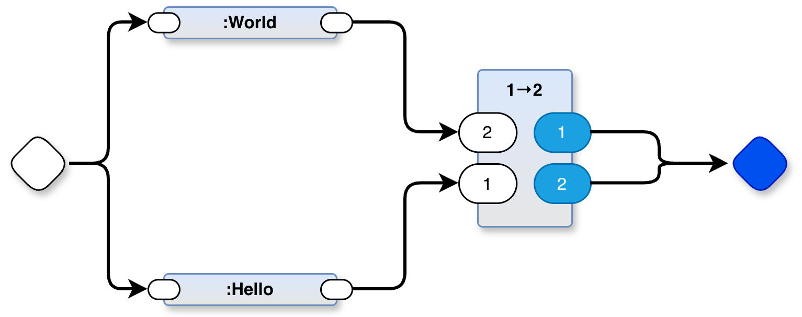

# Build helloworld demo in PBP from the diagram helloworld.drawio



# usage
`./@make

# Further:
If you want to build a fresh PBP project like this one, do the following:

```
>>> create a project directory and cd into it <<<
git clone https://github.com/guitarvydas/pbp
./pbp/@setup-tools.sh
cp ../pbp_helloworld/helloworld.drawio .
>>> create a diagram using the drawio editor (drawio.com) <<<
>>> customize the value of $TARGET in @defc (use the name of the diagram) <<<
./@make
